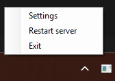
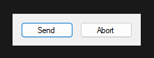
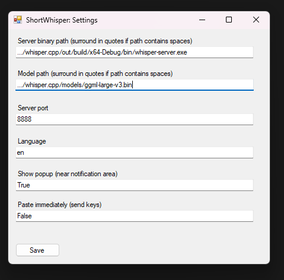

# Desktop Whisper

A WinForms application for Windows designed to simplify interaction with ggml-org/whisper.cpp/whisper-server.

## What can it do for you?

Desktop Whisper lets you start recording with a single click on the tray icon or via the Win+Alt+P shortcut.

When you’re finished, click **“Send”** to upload the recorded audio to the Whisper server. The recognized text will then be copied to your clipboard. Depending on your settings, you may see a popup or the text may be pasted directly into the active application.
If you change your mind, click **“Abort”** — the recording will stop and all recorded data will be discarded.

## What about configuration?

Right-click the tray icon → **Settings**. There you can specify the path to the whisper-server binary, the path to the GGUF model, the port, and other options.
After saving, you usually need to restart the whisper-server (tray icon → **Restart server**).

## Design

Desktop Whisper is a background service that spawns its own whisper-server instance. This allows them to be managed together, simplifying interaction. It might be worth adding support for using an external server in the future.
